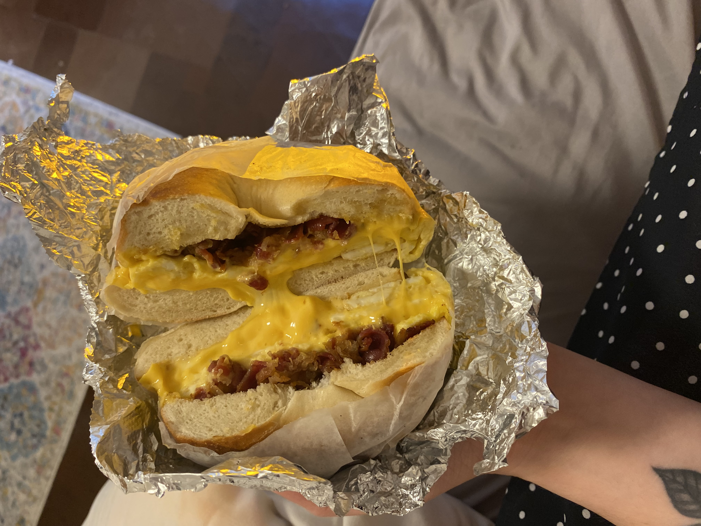
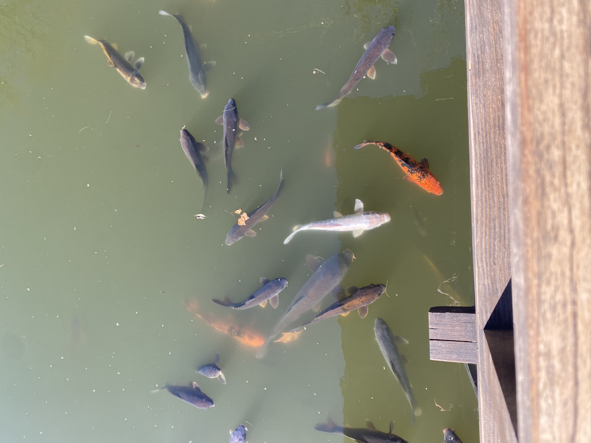

## Link to resume page
[resume](resume.html)

## Link to projects page
[projects](projects.html)

## Link to plotly page
[plotly](plotly.html)

## Link to dashboard page
[dashboard](dashboard.html)

```{r}
library(tidyverse)
```


```{r}
plot_df = 
  tibble(
    x=runif(100),
    y= 1+2+x+rnorm(100)
  )

plot_df |>
  ggplot(aes(x=x, y=y)) +
  geom_point()
```


Here's a link to the [about](about.html) page


# Here's a new section

Here is a bagel from Prestige!


Here are a bunch of fish in a pong at the botanical gardens!


Here are my friends staring at those fish! 


# Other stuff on this page

Definitely there is [plotly](plotly.html) stuff! 